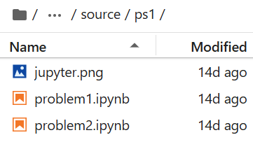
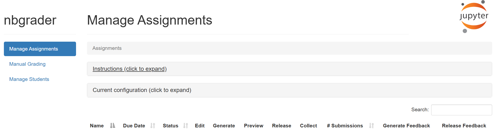
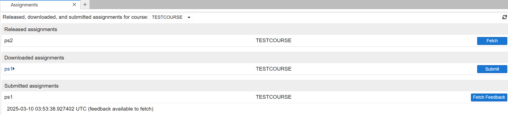
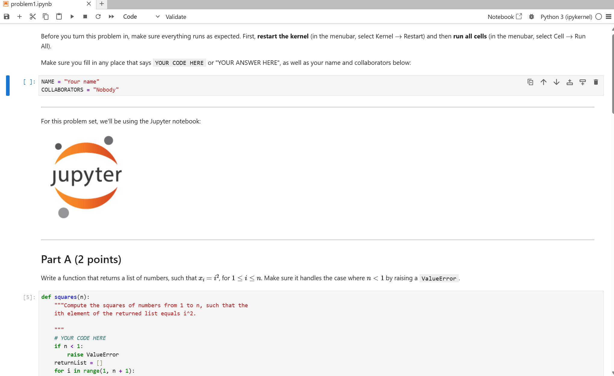

# Nbgrader-Testing
Testing Nbgrader on behalf of Georgia Tech

## Optimal Directory Structure
- There should be a parent folder (it can be called anything, but I'll refer to it as parentFolder)
- within parentFolder, there should be an exchange directory (it can be called anything, but I'll refer to it as exchangeFolder)
    - the exchange folder is where files that need to be transferred between students and instructors are (for downloading/submitting assignments primarily)
- also within parentFolder, there should be directories for each course - each course directory is a sibling to the other course directories and exchangeFolder
- within each course directory, you should create a directory called source
- a different copy of nbgrader_config.py should be present in each course directory (not in any of the subfolders within)

## nbgrader_config.py (needed for each course)
```python
c = get_config()

# this file could be stored in "/storage/home/hcodaman1/pkadekodi3/parentFolder/TESTCOURSE"

c.CourseDirectory.course_id = "TESTCOURSE" # difference courses have different ids

c.IncludeHeaderFooter.header = "header.ipynb" # this is optional - you can use this if you want a header for every jupyter notebook file. For instance, this header can include a space for name and collaborators

c.Exchange.root = "/storage/home/hcodaman1/pkadekodi3/parentFolder/exchange" # change this as needed, remember the directory structure mentioned above!
```

## Expanded nbgrader_config.py (OPTIONAL)
- Take a look at the nbgrader_config_full.py file in the repo for an example of a config file that has more advanced options commented out (note that if you use it, you have to call it nbgrader_config.py)

## Course Management
- Populate the source subdirectory of whichever course you are working on with your jupyter notebook assignments
    - The file structure should be source/assignmentName/file.ipynb
    - You can create new notebooks by clicking on File -> New -> Notebook in the nav bar
    - Example image below for an assignment called ps1



- To manage assignments and students, click on Nbgrader -> Formgrader in the nav bar
    - you should see a view that looks like the image below
    - click on Instructions to get more instructions for assignment creation
    - Generally, you want to Generate -> Release -> Collect -> Autograde (click on the number of submissions to do this) -> Manual Grade (do this in the manual grading tab on the left) -> Generate Feedback -> Release Feedback
- Click on Manage Students to create and edit students



## Doing Homework as a Student
- Navigate to Nbgrader -> Assignment List
    - Select Fetch to download new assignments
    - Under Downloaded Assignments, click on the name of the problem to do fill out the notebook
    - You can click on the Validate button (either from the Assignment List view or while filling out the homework) to check if there are any errors in your submission
    - Click Submit to submit your assignment
    - Once feedback is available, click Fetch Feedback to get your result

- The picture below is what you should see when you click Assignment 2 (in the picture, assignment ps2 has yet to be done, but assignment ps1 has been done and graded)



- The picture below is what it looks like when doing the assignment



## Bugs/Missing Functionality
- One bug I found was that you can't create courses using the GUI
    - normally, you should be able to by navigating to Nbgrader -> Create Assignment, but that option was greyed out, no matter which account I signed in with
- There is no easy way to delete a course with nbgrader
    - you have to navigate to the course subdirectory, delete it, and then restart JupyterHub

## Resources Used
https://www.youtube.com/watch?v=e0DuCAqe8dU&t=285s - created by Professor Ben Zwickl